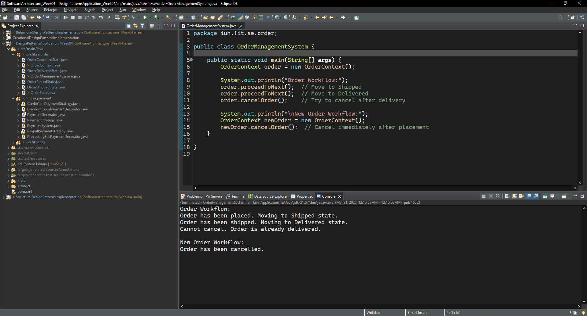

# Software Architecture Practice Exercises - Week 4

## Submission Information

*   **Full Name**: Dương Hoàng Lan Anh
*   **Student ID**: 21087481

---

## A> Java Design Patterns Code Implementation

### I) Creational Design Patterns:

#### 1. Singleton Pattern:
Reflection Singleton Test:

Serialization Singleton Test:

#### 2. Factory Pattern:

#### 3. Abstract Factory Pattern:
Test Abstract Factory Pattern:

#### 4. Builder Pattern:
Test Builder Pattern:

#### 5. Prototype Pattern:
Test Prototype Pattern:

---

### II) Structural Design Patterns:

#### 1. Adapter Pattern:
Test Adapter Pattern:

#### 2. Composite Pattern:
Test Composite Pattern:

#### 3. Proxy Pattern:
Test Proxy Pattern:

#### 4. Flyweight Pattern:
Test Flyweight Pattern:

#### 5. Facade Pattern:
Test Facade Pattern:

As a result, the pdf and html files were successfully exported from MySQL database:

#### 6. Bridge Pattern:
Test Bridge Pattern:

#### 7. Decorator Pattern:
Test Decorator Pattern:

---

### III) Behavioral Design Patterns:

---

## B> Design Patterns Application:

<u> ### Exercise 1: Order Management System </u>

**Giải thích về lựa chọn Design Pattern (State Pattern):**

- **Phù hợp với yêu cầu**: Bài toán yêu cầu hệ thống phải thay đổi hành vi dựa trên trạng thái đơn hàng. State Pattern sinh ra để giải quyết chính xác vấn đề này.
- **Mở rộng dễ dàng**: Nếu trong tương lai, chúng ta cần thêm trạng thái "Chờ thanh toán" hoặc "Hoàn thành", việc thêm các state class mới ( `WaitingPaymentState.java`, `CompletedState.java`) rất dễ dàng mà không ảnh hưởng đến code cũ.
- **Code rõ ràng, dễ bảo trì**: Logic xử lý cho từng trạng thái được tách biệt trong các class riêng, giúp code module hóa cao, dễ đọc và dễ bảo trì.

**Kết quả:**

**Kết luận:**
Sử dụng State Pattern giúp chúng ta xây dựng hệ thống quản lý đơn hàng một cách mềm dẻo, dễ bảo trì và mở rộng. Nó loại bỏ được sự phức tạp của việc dùng `if-else` lồng nhau để kiểm tra trạng thái, và thay vào đó tổ chức code một cách có cấu trúc và dễ hiểu.

<u> ### Exercise 2: Tax Calculation </u>

**Giải thích về lựa chọn Design Pattern (Strategy & Decorator Patterns):**

- **Strategy Pattern (Thuế)**:
    - **Tính linh hoạt thuật toán**: Strategy Pattern giúp dễ dàng thêm các loại thuế mới (ví dụ: thuế nhập khẩu, thuế môi trường...) chỉ bằng cách tạo thêm các Concrete Strategy Classes.
    - **Mã nguồn gọn gàng**: Logic tính từng loại thuế được tách ra khỏi class `Product`, làm `Product` class trở nên đơn giản và chỉ tập trung vào việc quản lý dữ liệu sản phẩm.
- **Decorator Pattern (Tính năng bổ sung)**:
    - **Tính mở rộng động**: Decorator cho phép chúng ta *thêm động* các tính năng bổ sung (giảm giá thuế, miễn thuế,...) cho việc tính thuế mà không cần sửa đổi code của các Strategy tính thuế gốc.
    - **Kết hợp linh hoạt**: Decorator có thể được kết hợp với nhau. Ví dụ: có thể có decorator "Giảm Thuế" kết hợp với decorator "Phí Xử Lý Thuế" (nếu bài toán phức tạp hơn).
    - **Nguyên tắc Open/Closed Principle**: Decorator Pattern tuân theo nguyên tắc Open/Closed Principle: mở rộng nhưng không sửa đổi code cũ.

**Kết quả:**

**Kết luận:**

Kết hợp Strategy Pattern và Decorator Pattern là một giải pháp mạnh mẽ và linh hoạt cho bài toán tính thuế. Strategy Pattern giúp quản lý các thuật toán tính thuế đa dạng, trong khi Decorator Pattern cho phép thêm các tính năng bổ sung một cách dễ dàng và tuân theo các nguyên tắc thiết kế hướng đối tượng tốt.

<u> ### Exercise 3: Payment System </u>

**Giải thích về lựa chọn Design Pattern (Strategy & Decorator Patterns):**

- **Strategy Pattern (Phương thức thanh toán)**:
    - **Dễ dàng thêm phương thức mới**: Strategy Pattern giúp thêm các phương thức thanh toán mới (ví dụ: ví điện tử MoMo, VNPay,...) một cách đơn giản, bằng cách tạo thêm các Concrete Strategy Classes mới implement `PaymentStrategy`.
    - **Linh hoạt lựa chọn runtime**: Client code có thể linh hoạt chọn phương thức thanh toán mong muốn tại thời điểm chạy chương trình.
- **Decorator Pattern (Tính năng bổ sung)**:
    - **Tính năng đa dạng và linh hoạt**: Decorator cho phép thêm các tính năng như phí xử lý, giảm giá, tích điểm, v.v. một cách linh hoạt.
    - **Tránh phình to class Strategy gốc**: Nếu chúng ta thêm các tính năng này trực tiếp vào `PaypalPaymentStrategy` hoặc `CreditCardPaymentStrategy`, code của các class này sẽ trở nên phình to và phức tạp. Decorator giúp tách các tính năng này ra các class decorator riêng, code module hóa và dễ quản lý hơn.
    - **Kết hợp decorator**:  Chúng ta có thể dễ dàng kết hợp nhiều decorators với nhau. Ví dụ, vừa áp dụng mã giảm giá, vừa tính phí xử lý cho cùng một giao dịch thanh toán.

**Kết quả:**

**Kết luận:**

Tương tự như bài toán thuế, Strategy và Decorator Pattern kết hợp với nhau tạo nên một hệ thống thanh toán rất mạnh mẽ. Strategy quản lý các phương thức thanh toán cốt lõi, còn Decorator đảm bảo khả năng mở rộng và tùy biến tính năng thanh toán theo nhu cầu thực tế, tuân thủ các nguyên tắc thiết kế tốt.
